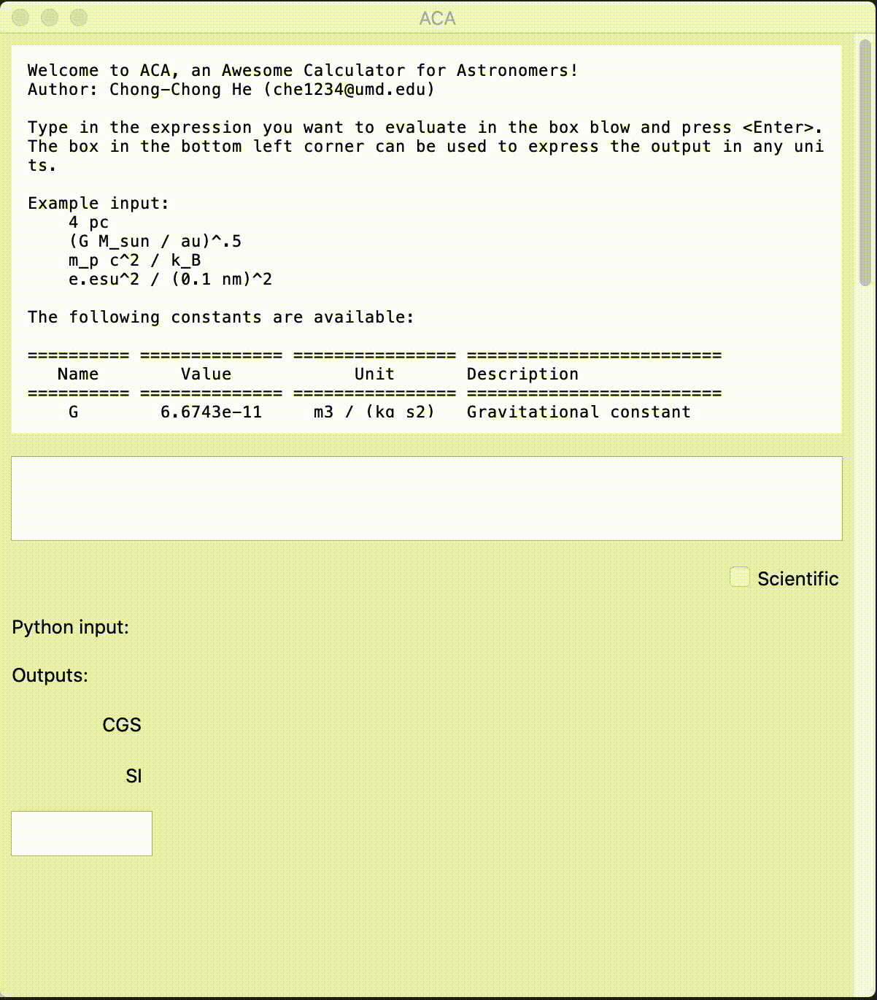

# ACAP: an Awesome Calculator for Astronomers and Physicists

## About

ACAP, an Awesome Calculator for Astronomers and Physicists.  
Author: Chong-Chong He (che1234@umd.edu)  
Date: 2020-06-20

This is a calculator designed for astronomers and physicists. This
program is written in Python with GUI. 

## How to run?

No installation required. As long as you have Python3 installed
(not tested on python2) with the required modules (astropy, tkinter,
and sympy), you can run this program with `python acap.py`. Or make it
as an executable and put it in your PATH.

## Example inputs

- sin(2.3) * 5!
- h
- m_e c^2  (then input MeV as user-defined unit)
- m_e c^2 / h  
- (G M_sun / au)^.5 (define output units as km/s)
- e.esu^2 / (0.1 nm)^2
